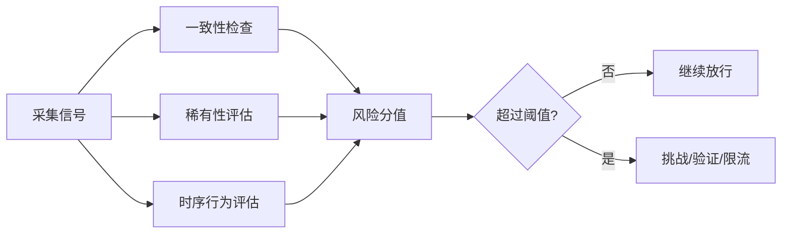
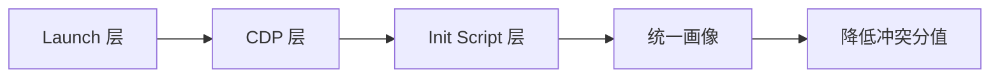
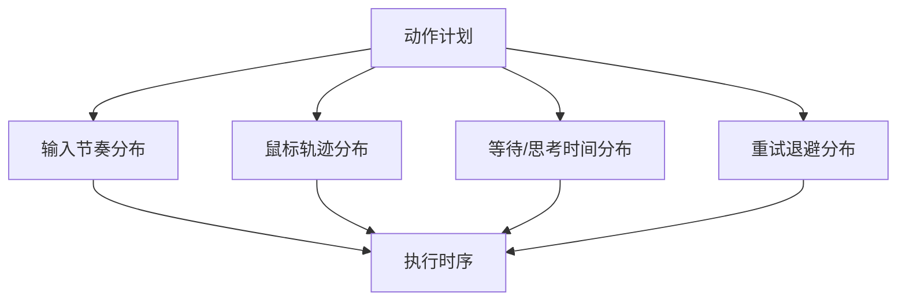

# 从「能跑」到「长期稳定」：agent-browser-stealth 的攻防工程实践

高风控站点对自动化会话的判断，通常不是单一规则命中，而是多信号打分。  
要点不在“补一个 patch”，而在“让整组信号在同一会话内自洽”。

项目地址：[leeguooooo/agent-browser](https://github.com/leeguooooo/agent-browser)

---

## 检测系统如何做判断

大多数检测系统会同时看三类问题：

1. **一致性**：UA、语言、时区、渲染能力是否互相匹配  
2. **稀有性**：是否出现低频但高度可疑的组合（如某些 headless 特征并存）  
3. **时序性**：输入、点击、等待、重试是否呈现机械节奏

评估通常是累积分值而非二元判断。  
同一个会话里的轻微异常可以被容忍，但跨维度冲突叠加后，容易触发挑战页或高频二次验证。

这个模型对应的治理原则很直接：

- 优先消除跨维度冲突
- 再处理低频高危特征
- 最后处理行为时序的机械性

---

## 指纹治理：从“补点”改成“信号闭环”

指纹治理按 `launch -> CDP -> init script` 三层执行。  
核心目标是把“可见信号”变成一张一致的画像，而不是局部拟真。

### Launch 层（本地启动时的基础面）

Launch 层处理“浏览器刚启动就暴露”的特征面：

- `--disable-blink-features=AutomationControlled`
- `--use-gl=angle`
- `--use-angle=default`
- 默认 UA 清洗（未自定义 UA 时去掉 `HeadlessChrome`）

原理：这层不追求“真实用户画像”，而是先消除明显自动化标识，避免会话在首屏前就进入高风险。

### CDP 层（运行时协议面）

CDP 层治理的是“同一身份在不同字段里的自我矛盾”：

- 同步覆盖 `userAgent`、`acceptLanguage`、`userAgentMetadata`
- 覆盖应持续作用于新旧 target
- 设置不透明背景，降低透明渲染特征

典型冲突示例：

- `userAgent` 显示某平台版本，但 `userAgentMetadata` brand/version 不对应
- 语言首选项与请求头不一致

这类冲突往往比“是否 headless”更早触发评分上升。

### Init Script 层（页面脚本前）

Init 层治理页面 JS 可直接探测的运行时表面。  
重点不是数量，而是覆盖高频检查路径。

高频治理面：

- Runtime 身份：`navigator.webdriver`、`chrome.runtime`、`cdc_`
- Navigator 能力：`languages/plugins/mimeTypes/permissions/userAgentData`
- 渲染能力：WebGL vendor/renderer
- 窗口屏幕：`outer*` / `screen*` / `avail*`
- 能力暴露：`share/contacts/contentIndex/mediaDevices/pdfViewerEnabled`
- 边缘特征：`connection/hardwareConcurrency/performance.memory`

### 指纹排障优先级

| 优先级 | 信号面 | 常见现象 | 先做什么 |
| --- | --- | --- | --- |
| P0 | UA + metadata + language | 首屏挑战页 | 先统一三者，再看其它项 |
| P1 | webdriver/runtime 痕迹 | 关键动作前即拦截 | 验证 init 注入是否在页面脚本前生效 |
| P2 | WebGL/screen | 间歇性二次验证 | 对齐渲染与窗口参数 |
| P3 | connection/memory 等边缘面 | 长链路后段异常 | 增量修复并对照回归 |

---

## 行为治理：让时序分布接近真实交互

行为检测通常不关心单次点击，而关注一段时间序列。  
真正会被命中的，是“低方差、强周期、强同步”的机器节奏。

### 输入节奏

固定字符延迟（例如全程 100ms）很容易形成可分辨模式。  
更稳妥的做法是“基线 + 抖动 + 语义停顿”：

- 基线延迟围绕输入场景变化
- 每字符有扰动，不保持等间隔
- 词边界、字段切换处出现较长停顿

### 鼠标轨迹

坐标瞬移与恒速直线是高风险模式。  
轨迹应包含：

- 曲线路径
- 中间采样点
- 速度变化（起步、调整、收敛）

### 等待与思考时间

固定等待常量会形成明显周期。  
建议使用区间采样，让同类操作在时间上有自然波动。

### 重试退避

命中风险后继续等间隔重试，通常会放大风险分值。  
退避策略应具备：

- 间隔递增
- 抖动扰动
- 次数上限

### 行为反模式

- 全链路固定输入延迟
- 点击前无移动直接命中目标
- 所有等待都是同一个常量
- 重试间隔完全一致
- 所有站点使用同一动作模板

---

## 2026-03 实战更新：Cloudflare 验证页恢复策略

在真实使用中，`dash.cloudflare.com` 一类站点常见 `Just a moment... / Performing security verification` 挑战页。  
关键问题不只是“被识别”，还包括“客户端过早刷新把挑战流程重置”，导致长期卡在验证中。

本次修复的关键点：

1. **风险信号增强**：从 `URL + Title` 扩展为 `URL + Title + PageText`  
   覆盖 `Performing security verification`、`This website uses a security service...` 等文本证据。
2. **恢复策略调整**：`risk-mode=warn` 先等待挑战自动放行，再进入重试  
   避免“重试即刷新”打断 Cloudflare 的挑战倒计时。
3. **会话稳定化**：未显式传 `--session-name` 时，默认跟随 `--session`  
   降低会话漂移造成的重复挑战概率。
4. **挑战窗口友好化**：减少过早刷新导致的挑战重置  
   让验证流程有足够时间自动完成，降低反复卡住的概率。

---

## 结语

指纹治理的重点是跨维度一致性。  
行为治理的重点是时间分布去机械化。  
把这两部分统一治理，通常能显著降低攻防波动。

项目地址：[leeguooooo/agent-browser](https://github.com/leeguooooo/agent-browser)
